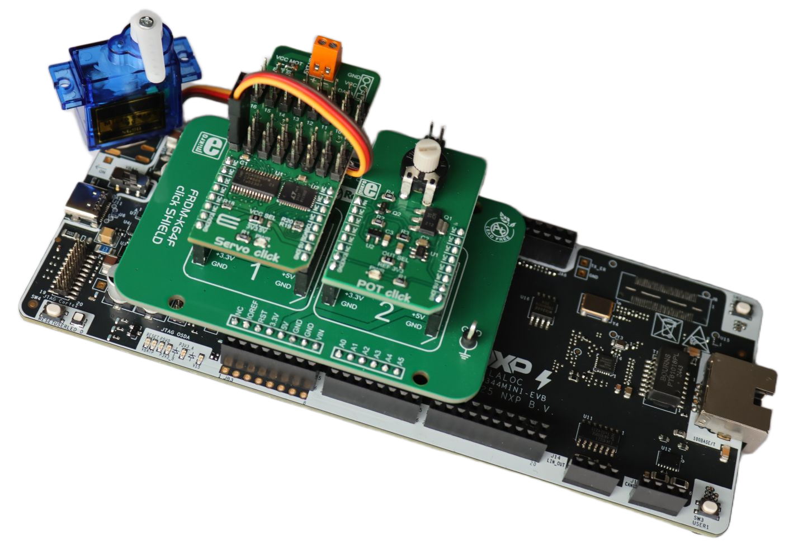
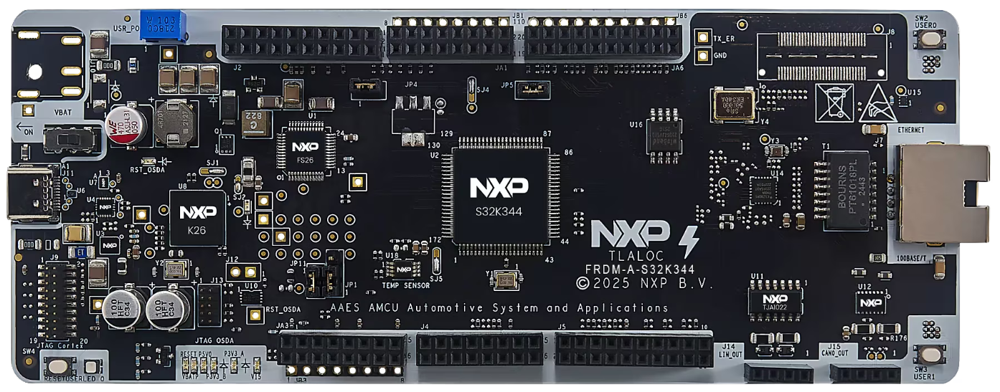
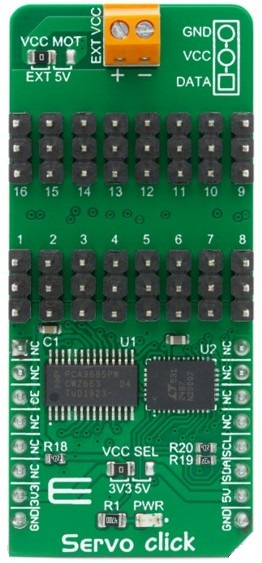
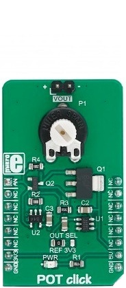
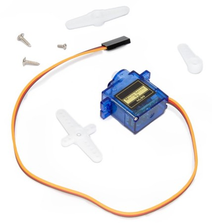
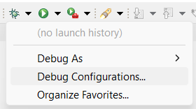
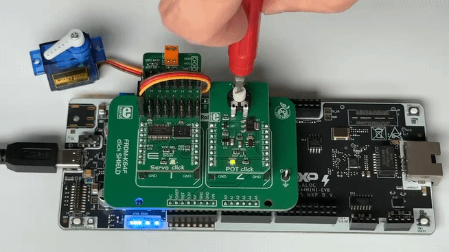

# NXP Application Code Hub

## Servo Steering Control Using PWM
This application implements a real-time steer-by-wire concept on the FRDM-A-S32K344 evaluation board. A POT Click potentiometer provides an analog steering-wheel input that is sampled via ADC0 , scaled to angular position, and converted into a PWM duty cycle that drives a Micro Servo SG 180° motor through a Servo Click board controlled over LPI2C1.  
On startup the servo centers to its neutral position; as the potentiometer is rotated the servo smoothly tracks the angle in real time, closing the full signal chain from analog acquisition → signal processing → actuator control.  
The project is built with the S32K3 Real-Time Drivers (RTD) for ADC, I2C, and GPIO peripherals, and is configured entirely within S32 Design Studio IDE — making it a practical reference for PWM-based motor control and sensor-to-actuator mapping in automotive prototyping.
[ ](./images/S32K344_Steering.png)

#### Boards: FRDM-A-S32K344
#### Categories: Sensor
#### Peripherals: I2C, PWM, ADC
#### Toolchains: S32 Design Studio IDE

## Table of Contents
1. [Software and Tools](#step1)
2. [Hardware](#step2)
3. [Setup](#step3)
4. [Results](#step4)
5. [Support](#step5)
6. [Release Notes](#step6)

## 1. Software and Tools
This example was developed using the FRDM Automotive Bundle for S32K3. To download and install the complete software and tools ecosystem, use the following link: 
- [ S32K3 FRDM Automotive Board Installation Package](https://www.nxp.com/app-autopackagemgr/automotive-software-package-manager:AUTO-SW-PACKAGE-MANAGER?currentTab=0&selectedDevices=S32K3&applicationVersionID=156)

## 2. Hardware
### 2.1 Required Hardware
- Personal Computer
- Type-C USB cable
  
| Boards | Images |
| ----------- | ------- |
| - [FRDM-A-S32K344](https://www.nxp.com/design/design-center/development-boards-and-designs/S32K344MINI-EVB) |  |
| - [FRDM K64 click shield](https://www.mikroe.com/frdm-k64-click-shield) | 
 |
| - [Servo Click](https://www.mikroe.com/servo-click)   - [POT Click](https://www.mikroe.com/pot-click)   | 
  |
|- [Micro Servo motor SG 180 degree](https://www.mikroe.com/micro-servo-motor-sg-180-degree) | 
 |

### 2.2 Hardware Connections
| FRDM-A-S32K344   | Header Pin |I/O| FRDM Shield  | Click Board   | Click Pin | Description  |
|------------------|------------|---|--------------|---------------|-----------|--------------|
| PTB17 GPIO, 49   | J2 pin 5   | → | D10          | Servo Click   | OE        | Output Enable|
| PTC6 LPI2C1_SDA  | J2 pin 17  | → | SDA          | Servo Click   | SDA       | I2C SDA Pin  |
| PTC7 LPI2C1_SCL  | J2 pin 19  | → | SCL          | Servo Click   | SCL       | I2C SCL Pin  |
| P5V0 power 5V    | JA3 pin 11 | → | 5V power     | Servo Click   | 5V        | VCC MOT move 0ohm to 5V |
| PTD0 ADC0_P1     | J4 pin 3   | ← | A1           | POT Click     | AN        | Analog Output|
| GND              | JA3 pin 11 | → | GND          | POT Click     | GND       | Ground       |
| VDD_PERH         | JA3 pin 7  | → | 3.3V         | POT Click     | 3V3       | 3.3V Power   |

**Note:** The Servo Click motor can be powered in two ways:

- **External Power (default)**: Connect an external 5V power supply to the Servo Click's VCC MOT terminal — no hardware modification is needed.
- **Board Power**: Move the VCC MOT 0Ω resistor from the EXT position to the 5V position on the Servo Click board. This allows the servo motor to be powered directly from the FRDM-A-S32K344 board's 5V rail, eliminating the need for an external power supply.

The Servo motor is connected to the Servo Click on the channel 1, folowing table:

| Servo Click | Servo Motor |
|-------------|-------------|
| GND         | Brown Wire  |
| VCC         | Red Wire    |
| PWM         | Orange Wire |

### 2.3 Debugger Connection
- Connect the Type-C USB cable to PC and FRDM-A-S32K344 board for power supply and debugging

## 3. Setup

### 3.1 Import the Project into S32 Design Studio IDE
1. Open S32 Design Studio IDE, in the Dashboard Panel, choose **Import project from Application Code Hub**.
[

](./images/import_project_1.png)

2. You can find the demo you need by searching for the name directly.
 Open the project, click the **GitHub link** from this window, S32 Design Studio IDE will automatically retrieve project attributes then click **Next>**.
[

](./images/import_project_3.png)

3. Select **main** branch and then click **Next>**.
4. Select your local path for the repo in **Destination->Directory** window. The S32 Design Studio IDE will clone the repo into this path, click **Next>**.

5. Select **Import existing Eclipse projects** then click **Next>**.

6. Select the project in this repo (only one project in this repo) then click **Finish**.
### 3.2 Generating, Building and Running the Example
1. In Project Explorer, right-click the project and select **Update Code and Build Project**. This will generate the configuration (Pins, Clocks, Peripherals), update the source code and build the project using the active configuration (e.g. Debug_FLASH).
Make sure the build completes successfully and the *.elf file is generated without errors.
[

](./images/update_and_build.png)
Press **Yes** in the **SDK Component Management** pop-up window to continue.

2. Go to **Debug** and select **Debug Configurations**. There will be a debug configuration for this project:
[

](./images/Debug_config.png)

        Configuration Name                  Description
        -------------------------------     -----------------------
        $(example)_debug_flash_pemicro      Debug the FLASH configuration using PEmicro probe

    Select the desired debug configuration and click on **Debug**. Now the perspective will change to the **Debug Perspective**.
    Use the controls to control the program flow.

## 4. Results
The servo motor follows the potentiometer position in real-time, simulating a steering control system. Upon startup, the servo centers to its neutral position. As the user rotates the potentiometer, the ADC reads the analog input and maps it to a corresponding PWM duty cycle, causing the servo to smoothly track the potentiometer angle. This demonstrates a basic steer-by-wire concept where driver input (potentiometer) is translated into actuator movement (servo).
[

](./images/S32K344_Steering_Demo.gif)

## 5. Support
For general technical questions related to NXP microcontrollers, please use the *NXP Community Forum*.
#### Project Metadata

<!----- Boards ----->

<!----- Categories ----->

<!----- Peripherals ----->

<!----- Toolchains ----->

Questions regarding the content/correctness of this example can be entered as Issues within this GitHub repository.

>**Warning**: For more general technical questions regarding NXP Microcontrollers and the difference in expected functionality, enter your questions on the [NXP Community Forum](https://community.nxp.com/)

## 6. Release Notes
| Version | Description / Update                           | Date                        |
|:-------:|------------------------------------------------|----------------------------:|
| 1.0     | Initial release on Application Code Hub        | May 22th 2026     |